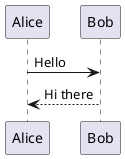
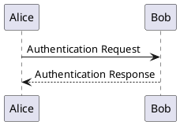
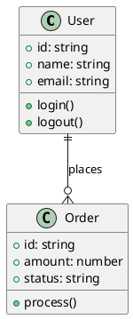

# PlantUML MCP Server

A [Model Context Protocol (MCP)](https://modelcontextprotocol.io/) server that provides PlantUML diagram generation capabilities for Claude Code and other MCP clients.

## Features

- **Generate PlantUML Diagrams**: Create diagrams from PlantUML code and get embeddable URLs
- **Multiple Output Formats**: Support for SVG and PNG formats  
- **PlantUML Encoding**: Encode PlantUML code for direct URL usage
- **PlantUML Decoding**: Decode encoded PlantUML strings back to readable code
- **External Includes**: Full support for `!include` directives and external libraries
- **Configurable Server**: Use any PlantUML server endpoint

## Installation

### Prerequisites
- Node.js 18+ 
- npm

### Quick Setup

```bash
# Clone the project
git clone https://github.com/mzagar/plantuml-mcp-server.git
cd plantuml-mcp-server

# Full setup (install, build, and show Claude Code configuration)
make setup
```

### Manual Setup

```bash
# Install dependencies
npm install

# Build the project
npm run build

# Make executable
chmod +x dist/plantuml-mcp-server.js
```

## Usage

### With Claude Code

Add to your `~/.claude-mcp/config.json`:

```json
{
  "servers": {
    "plantuml": {
      "command": "node",
      "args": ["/path/to/plantuml-mcp-server/dist/plantuml-mcp-server.js"],
      "env": {
        "PLANTUML_SERVER_URL": "https://www.plantuml.com/plantuml"
      }
    }
  }
}
```

Then restart Claude Code to activate the MCP server.

### Available Tools

#### 1. `generate_plantuml_diagram`

Generates a PlantUML diagram and returns embeddable image URLs.

**Parameters:**
- `plantuml_code` (string, required): PlantUML diagram code
- `format` (string, optional): Output format - "svg" (default) or "png"

**Example:**


#### 2. `encode_plantuml`

Encodes PlantUML code for direct URL usage.

**Parameters:**
- `plantuml_code` (string, required): PlantUML diagram code to encode

#### 3. `decode_plantuml`

Decodes encoded PlantUML strings back to readable PlantUML code.

**Parameters:**
- `encoded_string` (string, required): Encoded PlantUML string to decode

## Examples

### Basic Sequence Diagram


### C4 Architecture Diagram with !include
```plantuml
@startuml
!include https://raw.githubusercontent.com/plantuml-stdlib/C4-PlantUML/master/C4_Container.puml

Person(user, "User")
Container(web, "Web App", "React", "User interface")
Container(api, "API", "Node.js", "Backend API")

Rel(user, web, "Uses")
Rel(web, api, "Calls")
@enduml
```

### Class Diagram


## Development

### Available Make Commands

```bash
make install      # Install dependencies
make build        # Build TypeScript to JavaScript  
make run          # Build and run the server
make dev          # Run in development mode (watch)
make test         # Test the server
make test-mcp     # Test with mcptools CLI
make clean        # Clean build directory
make setup        # Full setup (install + build + instructions)
make setup-claude # Show Claude Code setup instructions
make help         # Show all available commands
```

### Testing

```bash
# Test with mcptools CLI (includes !include directive test)
make test-mcp

# Run server locally for testing
make run
```

The test suite includes:
- Basic PlantUML encoding test
- PlantUML decoding test
- Diagram generation test 
- Advanced test with `!include` directive and C4 diagrams

### Configuration

Set the PlantUML server URL via environment variable:

```bash
PLANTUML_SERVER_URL=https://your-plantuml-server.com make test-mcp
```

Default server: `https://www.plantuml.com/plantuml`

## Architecture

- **Single File Design**: Main logic in `src/plantuml-mcp-server.ts`
- **Library-based Encoding**: Uses `plantuml-encoder` library for reliable PlantUML URL encoding
- **MCP Protocol**: Built on `@modelcontextprotocol/sdk` for Claude Code integration
- **TypeScript**: Full TypeScript support with strict type checking

## Requirements

- Node.js 18+
- MCP client (like Claude Code)
- Internet access for PlantUML server and `!include` directives

## License

This project is licensed under the MIT License - see the [LICENSE](LICENSE) file for details.

## Contributing

1. Fork the repository
2. Create your feature branch (`git checkout -b feature/amazing-feature`)
3. Commit your changes (`git commit -m 'Add some amazing feature'`)
4. Push to the branch (`git push origin feature/amazing-feature`)
5. Open a Pull Request

## Acknowledgments

- [PlantUML](https://plantuml.com/) - The amazing diagramming tool
- [Model Context Protocol](https://github.com/anthropics/mcp) - The protocol this server implements
- [plantuml-encoder](https://www.npmjs.com/package/plantuml-encoder) - PlantUML encoding/decoding library